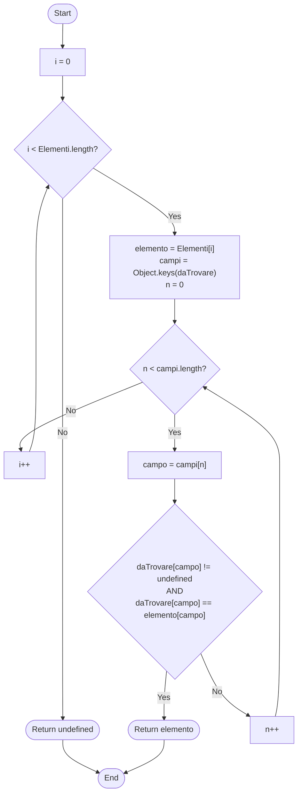

```mermaid
flowchart TD
    Start([Start]) --> InitOuter[i = 0]
    InitOuter --> CheckOuter{i < Elementi.length?}
    
    CheckOuter -- No --> ReturnUndefined([Return undefined])
    ReturnUndefined --> End([End])
    
    CheckOuter -- Yes --> InitInner["elemento = Elementi[i]\ncampi = Object.keys(daTrovare)\nn = 0"]
    InitInner --> CheckInner{n < campi.length?}
    
    CheckInner -- No --> IncOuter[i++]
    IncOuter --> CheckOuter
    
    CheckInner -- Yes --> GetCampo["campo = campi[n]"]
    GetCampo --> CheckMatch{"daTrovare[campo] != undefined\nAND\ndaTrovare[campo] == elemento[campo]"}
    
    CheckMatch -- Yes --> ReturnElemento([Return elemento])
    ReturnElemento --> End
    
    CheckMatch -- No --> IncInner[n++]
    IncInner --> CheckInner
```